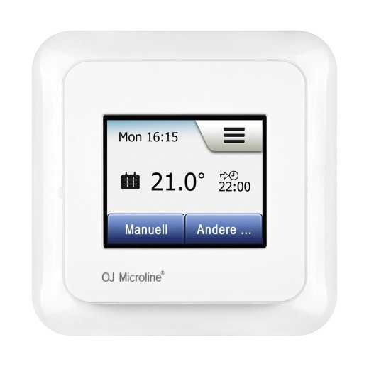

# ioBroker.schlueter-thermostat

**Tests:** 

# Schlueter Thermostat

Cloud adapter for **Schlüter / OJ Microline OWD5 thermostats**.\
The adapter connects to the official **OWD5 (read)** and **OCD5
(write)** cloud APIs to fully integrate thermostats into ioBroker.

This adapter is **cloud-only** --- no local gateway or Modbus required.
The complete API can be tested at: https://ocd5.azurewebsites.net/swagger/ui/index#/

## Attention:

I only have one thermostat. So I'm not sure, how it looks like with multiple thermostats.
I will check it, if I get a second one, especially for energy valuse for each thermostat.

---

## 🧩 Architecture

    ioBroker
       │
       │  REST (HTTPS)
       ▼
    schlueter-thermostat Adapter
       │
       ├───────────────► OWD5 Cloud API (READ)
       │                  - Groups
       │                  - Thermostats
       │                  - Schedule
       │                  - Energy usage
       │
       └───────────────► OCD5 Cloud API (WRITE)
                          - Setpoints
                          - Modes
                          - End times
                          - Vacation
                          - Thermostat name
                               │
                               ▼
                     Schlüter / OJ Microline Thermostats

---

## ⚙ How the Adapter Works

1.  **Login** to OWD5 cloud with your credentials.
2.  **Polling** at configured interval (default 60s):
    - Reads **GroupContents**
    - Creates/updates group & thermostat objects
    - Reads temperatures, modes, setpoints, schedules
    - Reads energy usage per thermostat (via SerialNumber)
3.  When a writable state changes:
    - Adapter builds full **UpdateThermostat payload**
    - Sends it to **OCD5 cloud**
4.  Cloud forwards the command to the thermostat.

---

## 👤 Required User Data

Setting Description

---

Username Your Schlüter/OJ cloud login -> **setted in your APP**
Password Cloud password -> **setted in your APP**
API Key Provided API key -> **use Default; It seems to work**
Customer ID Your cloud customer ID -> **to find in you thermostat information**
Client SW Version Required by API (numeric) -> **to find in your thermostat information**
Poll Interval Seconds between cloud polls

---

## 🏠 Object Structure

    schlueter-thermostat.0
    └─ groups
       └─ <GroupId> (device)
          └─ thermostats
             └─ <ThermostatId> (device)

---

## 🌡 What Can Be Read

Category States

---

Temperatures Room, Floor
Setpoints Manual, Comfort
Modes RegulationMode
End Times ComfortEndTime, BoostEndTime
Vacation Enabled, Begin, End, Temperature
Schedule All days + events
Energy kWh history values

---

## ✍ What Can Be Written

State Description

---

setpoint.manualSet Manual temperature
setpoint.comfortSet Comfort temperature
regulationModeSet Mode change
thermostatNameSet Rename thermostat
endTime.comfortSet Comfort end time
endTime.boostSet Boost end time
vacation.enabledSet Enable vacation
vacation.beginSet Vacation start
vacation.endSet Vacation end
vacation.temperatureSet Vacation temperature

---

## 🔥 Reglulation Mode Logic

When `regulationModeSet = 1`:

- Schedule Plan as defined in APP

When `regulationModeSet = 2`:

- Comfort Mode is active for setted Time in h
- Temperature = setted Temperature

When `regulationModeSet = 3`:

- Manual Mode is active for undefined time
- Temperature = setted Temperature

When `regulationModeSet = 8`:

- Boost end time = **now + 1 hour**
- Temperature = thermostat maximum

When `regulationModeSet = 9`:

- Eco Mode is active
- Temperature = 20 degrees

There some more......

---

## 🔁 State Flow Diagram

                ┌──────────┐
                │   AUTO   │
                └─────┬────┘
                      │
              comfortSetpoint
                      ▼
                ┌──────────┐
                │ COMFORT  │
                └─────┬────┘
                      │ manualSetpoint
                      ▼
                ┌──────────┐
                │  MANUAL  │
                └─────┬────┘
                      │ regulationMode=8
                      ▼
                ┌──────────┐
                │  BOOST   │
                │ (1 hour) │
                └─────┬────┘
                      │ endTime reached
                      ▼
                back to previous mode

Vacation overrides all heating modes when enabled.

---

## ⚡ Energy

Energy values are provided per thermostat:

    energy.count
    energy.value0
    energy.value1
    ...

## **It starts with the Energy from today.**

## 🛡 Stability

- Safe object/state wrappers
- Graceful shutdown
- Poll protection
- Debug logging

---

## 🐛 Debug

Enable **debug log level** to see cloud communication.

---

## 📦 Version

### Changelog

<!--
	Placeholder for the next version (at the beginning of the line):
	### **WORK IN PROGRESS**
-->
### 0.2.4 (2026-01-28)

- (patricknitsch) Change Format of Times

### 0.2.3 (2026-01-28)

- (patricknitsch) Catch wrong values for Temperature and Regulation Mode

### 0.2.2 (2026-01-28)

- (patricknitsch) Update setStates for ComfortMode
- (patricknitsch) More Debugging

### 0.2.1 (2026-01-28)

- (patricknitsch) Fix JsonConfig

### 0.2.0 (2026-01-28)

- (patricknitsch) add automatic Refresh of Token after Error 403
- (patricknitsch) fix max Value of Regulation Mode to 9 for error preventing
- (patricknitsch) improve Handling of Mode Settings

### 0.1.1 (2026-01-28)

- (patricknitsch) updated Readme

### 0.1.0 (2026-01-28)

- (patricknitsch) initial release
- (patricknitsch) fetch data and write in Datapoints
- (patricknitsch) functional version with Energy and settable functions

## License

MIT License

Copyright (c) 2026 patricknitsch <patricknitsch@web.de>

Permission is hereby granted, free of charge, to any person obtaining a copy
of this software and associated documentation files (the "Software"), to deal
in the Software without restriction, including without limitation the rights
to use, copy, modify, merge, publish, distribute, sublicense, and/or sell
copies of the Software, and to permit persons to whom the Software is
furnished to do so, subject to the following conditions:

The above copyright notice and this permission notice shall be included in all
copies or substantial portions of the Software.

THE SOFTWARE IS PROVIDED "AS IS", WITHOUT WARRANTY OF ANY KIND, EXPRESS OR
IMPLIED, INCLUDING BUT NOT LIMITED TO THE WARRANTIES OF MERCHANTABILITY,
FITNESS FOR A PARTICULAR PURPOSE AND NONINFRINGEMENT. IN NO EVENT SHALL THE
AUTHORS OR COPYRIGHT HOLDERS BE LIABLE FOR ANY CLAIM, DAMAGES OR OTHER
LIABILITY, WHETHER IN AN ACTION OF CONTRACT, TORT OR OTHERWISE, ARISING FROM,
OUT OF OR IN CONNECTION WITH THE SOFTWARE OR THE USE OR OTHER DEALINGS IN THE
SOFTWARE.
