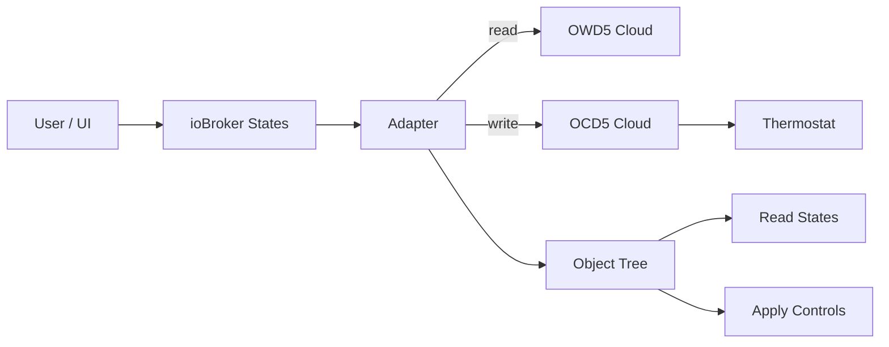
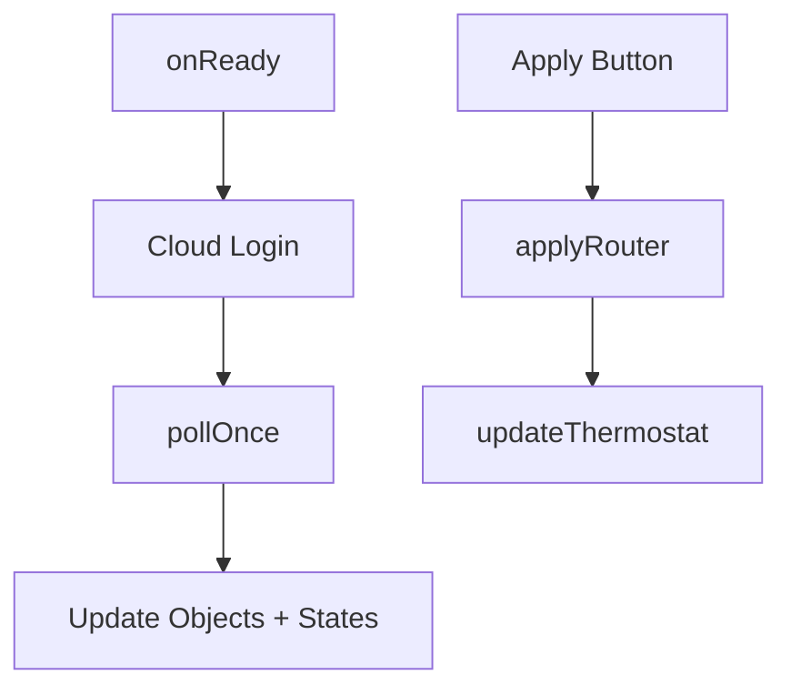

# ioBroker.schlueter-thermostat

**Tests:** 

---

##

## 🌍 Overview

This adapter integrates **Schlüter / OJ Microline OWD5 thermostats** into ioBroker via the **official cloud APIs**.

It is based on the HA Integration from @robbinjanssen. For more informations see the documentation.

> **Cloud-only** — no local gateway, Modbus, or LAN API required.

##

## 🚀 How to Start

1. Install adapter in ioBroker
2. Open instance configuration
3. Enter:

| Setting           | Description                   |
| ----------------- | ----------------------------- |
| Username          | Your Schlüter/OJ cloud login  |
| Password          | Cloud password                |
| API Key           | Below works in most cases     |
| Customer ID       | Found in thermostat info      |
| Client SW Version | Numeric value from thermostat |
| Poll Interval     | Default: 60 seconds           |

4. Save & start adapter

For API-Key you can try with: `f219aab4-9ac0-4343-8422-b72203e2fac9`.
You can find this Key in Forum: `https://community.home-assistant.io/t/mwd5-wifi-thermostat-oj-electronics-microtemp/445601`, so it looks like a
global Key.

##

## Documentation

[🇺🇸 Documentation](./docs/en/README.md)

[🇩🇪 Dokumentation](./docs/de/README.md)

##

## Compact Architecture Overview

### Architecture Badges

### Compact Program Structure

### Internal Flow (Mini)

##

## 📌 Notes

- Developed and tested with a single thermostat
- Multi-device environments supported, but feedback welcome

##

## Changelog

<!--
	Placeholder for the next version (at the beginning of the line):
	### **WORK IN PROGRESS**
-->

### 0.3.1 (2026-01-31)

- (patricknitsch) Add Mode Frost Protection
- (patricknitsch) Show Enum instead of Regulation Number

### 0.3.0 (2026-01-31)

- (patricknitsch) Update Readme
- (patricknitsch) Verify Polling if Thermostat give no Response
- (patricknitsch) Complete Refactoring to handle functions better
- (patricknitsch) encrypt all sensitive credentials -> Relogin necessary
- (patricknitsch) Code Fixing for latest repo

### 0.2.4 (2026-01-28)

- (patricknitsch) Change Format of Times

### 0.2.3 (2026-01-28)

- (patricknitsch) Catch wrong values for Temperature and Regulation Mode

### 0.2.2 (2026-01-28)

- (patricknitsch) Update setStates for ComfortMode
- (patricknitsch) More Debugging

### 0.2.1 (2026-01-28)

- (patricknitsch) Fix JsonConfig

### 0.2.0 (2026-01-28)

- (patricknitsch) add automatic Refresh of Token after Error 403
- (patricknitsch) fix max Value of Regulation Mode to 9 for error preventing
- (patricknitsch) improve Handling of Mode Settings

### 0.1.1 (2026-01-28)

- (patricknitsch) updated Readme

### 0.1.0 (2026-01-28)

- (patricknitsch) initial release
- (patricknitsch) fetch data and write in Datapoints
- (patricknitsch) functional version with Energy and settable functions

##

## License

MIT License

Copyright (c) 2026 patricknitsch <patricknitsch@web.de>

Permission is hereby granted, free of charge, to any person obtaining a copy
of this software and associated documentation files (the "Software"), to deal
in the Software without restriction, including without limitation the rights
to use, copy, modify, merge, publish, distribute, sublicense, and/or sell
copies of the Software, and to permit persons to whom the Software is
furnished to do so, subject to the following conditions:

The above copyright notice and this permission notice shall be included in all
copies or substantial portions of the Software.

THE SOFTWARE IS PROVIDED "AS IS", WITHOUT WARRANTY OF ANY KIND, EXPRESS OR
IMPLIED, INCLUDING BUT NOT LIMITED TO THE WARRANTIES OF MERCHANTABILITY,
FITNESS FOR A PARTICULAR PURPOSE AND NONINFRINGEMENT. IN NO EVENT SHALL THE
AUTHORS OR COPYRIGHT HOLDERS BE LIABLE FOR ANY CLAIM, DAMAGES OR OTHER
LIABILITY, WHETHER IN AN ACTION OF CONTRACT, TORT OR OTHERWISE, ARISING FROM,
OUT OF OR IN CONNECTION WITH THE SOFTWARE OR THE USE OR OTHER DEALINGS IN THE
SOFTWARE.
