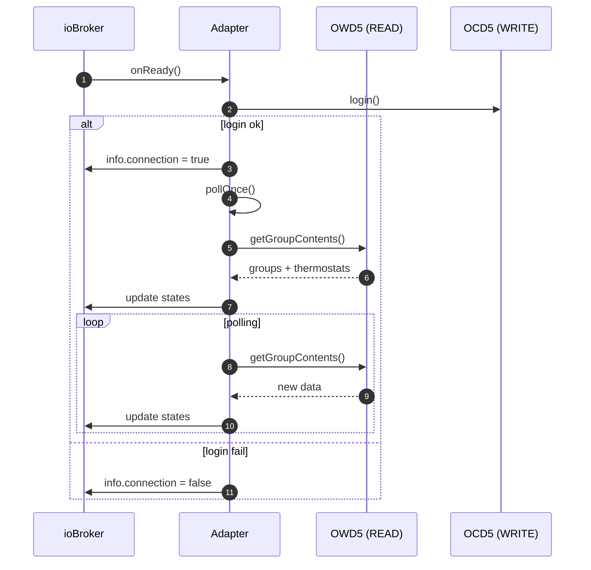
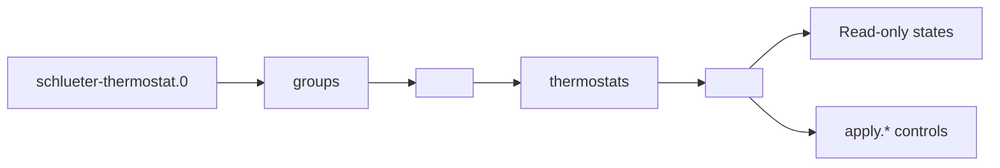
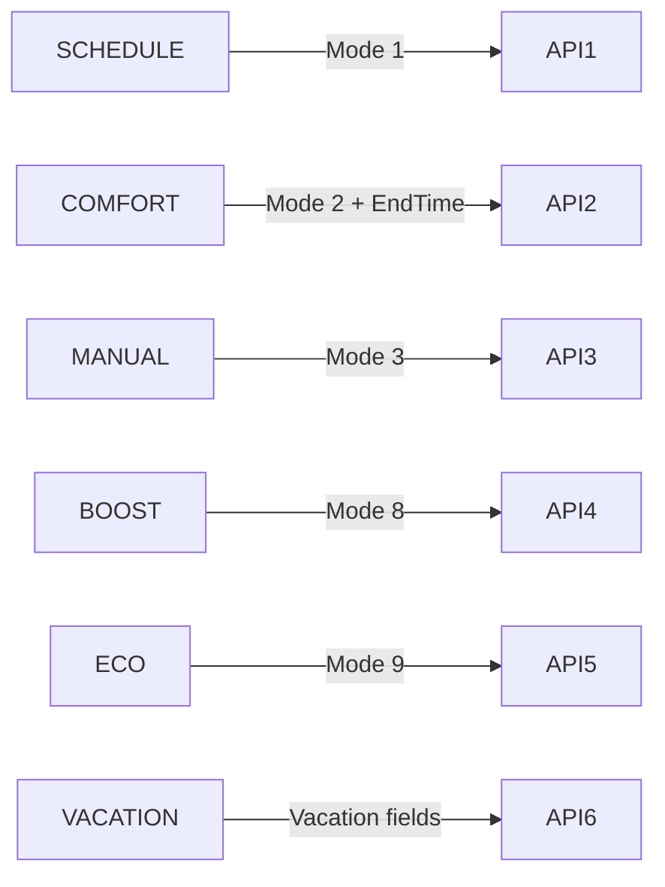
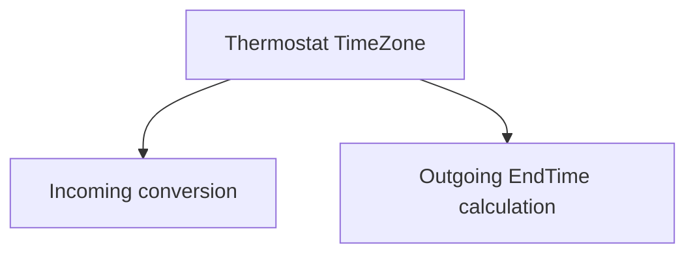

# schlueter-thermostat Adapter – Program Structure Documentation

## High-Level Architecture

```mermaid
flowchart TB
  U[User / UI / Scripts] -->|write states| IO[(ioBroker States DB)]
  IO -->|stateChange events| ADP[schlueter-thermostat Adapter]

  ADP -->|HTTPS REST (read)| OWD5[OWD5 Cloud API (Read)]
  ADP -->|HTTPS REST (write)| OCD5[OCD5 Cloud API (Write)]
  OCD5 --> TH[Schlüter / OJ Thermostat]
  OWD5 --> ADP
```

## Runtime Lifecycle



## Object Tree



## Apply Flow

```mermaid
flowchart TB
  BTN[apply.<mode>.apply] --> EVT[onStateChange()]
  EVT --> ROUTE[applyRouter()]
  ROUTE --> API[updateThermostat()]
  API --> TH[Cloud → Thermostat]
```

## Apply Modes



## Time Handling


